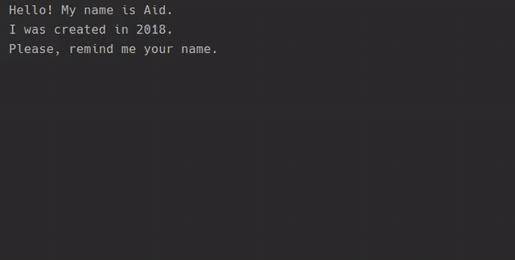

# Simple chatbot
A simple chatbot which plays with word and guess numbers 
https://hyperskill.org/projects/97

## Stages
__Stage 1:  Hello! What's your name?__ 
Teach your assistant to introduce itself in the console.

__Stage 2: What's my name?__ 
Introduce youself to the bot.

__Stage 3: How old are you?__ 
Use your knowledge of strings and numbers to make the assistant guess your age.

__Stage 4: Let's count!__ 
Your assistant is old enough to learn how to count. And you are experienced enough to apply a for loop at this stage!

__Stage 5: The student and the teaches__ 
At this point, the assistant will be able to check your knowledge and ask multiple-choice questions. Add some functions to your code and make the stage even better.
